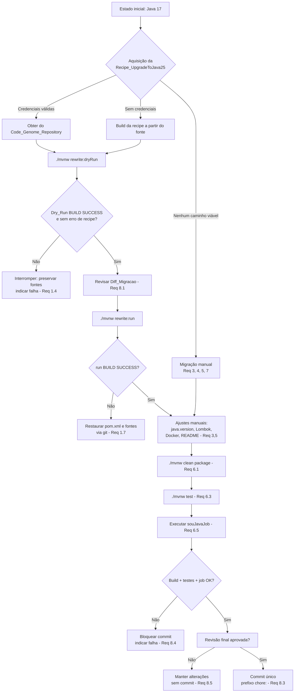

# Design Document

## Overview

Este documento descreve o design da atualização do **Projeto** de **Java 17** para **Java 25**, tendo o **OpenRewrite** (recipe `org.openrewrite.java.migrate.UpgradeToJava25`) como mecanismo primário de migração automatizada, com caminhos alternativos (build da recipe a partir do código-fonte e migração manual) para os casos em que a aquisição do artefato da recipe não for possível.

O projeto é uma aplicação Spring Boot 4.0.8 / Spring Batch 6.0.5 / Spring Cloud 2025.1.3 / Spring Cloud Task 2.5.0.RELEASE, empacotada como Spring Cloud Task (`@EnableTask`) e construída com Maven (wrapper `./mvnw`). O objetivo central é elevar o alvo de compilação e execução para Java 25 **preservando o comportamento funcional** do **Job_Batch** `souJavaJob` (leitura do arquivo de largura fixa → mapeamento dos registros multi-linha → persistência das entidades JPA `Transaction` + `RegType*`).

A migração é organizada em torno de um fluxo controlado — **Dry_Run** (pré-visualização) → revisão → **run** (aplicação) → validação (build + testes + execução do job) → commit — usando a árvore de trabalho do Git como rede de segurança para rollback. Onde o OpenRewrite não cobre uma mudança, o design prevê ajustes manuais complementares (propriedade `java.version`, alinhamento da versão do Lombok, imagens Docker, referências no `README.md`).

O design mapeia diretamente os oito requisitos aprovados:

- **Requisito 1** → Integração e fluxo do OpenRewrite (seções *OpenRewrite Integration* e *Fluxo Dry_Run → run*).
- **Requisito 2** → Estratégia de aquisição do artefato da recipe (seção *Estratégia de Aquisição do Artefato da Recipe*).
- **Requisito 3** → Alterações manuais de build (`java.version`, Lombok).
- **Requisito 4** → Análise de compatibilidade de dependências e plugins.
- **Requisito 5** → Atualização das imagens Docker e referências de JDK.
- **Requisito 6** → Estratégia de validação (build/testes/job).
- **Requisito 7** → Tratamento de APIs depreciadas/removidas e flags de JVM.
- **Requisito 8** → Fluxo de revisão do diff e commit.

### Escopo e não-escopo

- **Em escopo:** configuração do `rewrite-maven-plugin`, `java.version=25`, alinhamento do Lombok, verificação de compatibilidade de dependências/plugins, atualização das imagens Docker/compose e `README.md`, validação de build/testes/job, tratamento de APIs depreciadas e flags de JVM, e o fluxo de revisão/commit.
- **Fora de escopo:** mudanças funcionais no Job_Batch, refatorações que não sejam consequência direta da migração, e a implementação real do `FileDownloadTasklet` (stub intencional, preservado como está).

## Architecture

### Visão de alto nível do fluxo de migração



### Componentes envolvidos na migração

A migração não introduz novos componentes de runtime na aplicação; ela atua sobre a **configuração de build**, a **infraestrutura de containers** e a **documentação**. Os artefatos afetados são:

- `pom.xml` — propriedade `java.version`, configuração do `rewrite-maven-plugin`, alinhamento de versão do Lombok em `annotationProcessorPaths`, e eventuais bumps de versão de dependências/plugins.
- `~/.m2/settings.xml` (ambiente local e CI) — entrada `<server>` com credenciais do **Code_Genome_Repository** (token via variável de ambiente, **não** comitado no repositório).
- `docker/Dockerfile`, `docker/docker-compose.yml`, `docker/docker-compose-postgres.yml`, `docker/docker-compose-prometheus.yml` — tags de imagem e defaults de `SKIPPER_VERSION` / `DATAFLOW_VERSION`.
- `README.md` — menções textuais à versão de JDK e comandos de docker-compose.
- Código-fonte Java em `src/main/java` — apenas se a recipe (ou o tratamento manual do Requisito 7) substituir APIs depreciadas/removidas.

### Rede de segurança e rollback

O rollback se apoia na árvore de trabalho do Git: antes de `./mvnw rewrite:run` o repositório deve estar limpo (sem alterações não commitadas), de modo que qualquer aplicação indesejada da recipe ou falha de build possa ser revertida com `git restore` / `git checkout -- .` (Requisitos 1.4, 1.7). O **Dry_Run** nunca modifica arquivos-fonte; ele apenas gera o **Diff_Migracao** (`rewrite.patch` + saída no console) para revisão (Requisito 1.2).

## Components and Interfaces

### 1. Integração do OpenRewrite no build (Requisito 1)

O `rewrite-maven-plugin` é declarado no bloco `<build><plugins>` do `pom.xml`, com a recipe ativa e a dependência da biblioteca de recipes de migração:

```xml
<plugin>
  <groupId>org.openrewrite.maven</groupId>
  <artifactId>rewrite-maven-plugin</artifactId>
  <version>${rewrite-maven-plugin.version}</version>
  <configuration>
    <activeRecipes>
      <recipe>org.openrewrite.java.migrate.UpgradeToJava25</recipe>
    </activeRecipes>
  </configuration>
  <dependencies>
    <dependency>
      <groupId>org.openrewrite.recipe</groupId>
      <artifactId>rewrite-migrate-java</artifactId>
      <version>${rewrite-migrate-java.version}</version>
    </dependency>
  </dependencies>
</plugin>
```

As versões exatas de `rewrite-maven-plugin` e `rewrite-migrate-java` **devem ser fixadas na fase de implementação**, escolhendo o par de versões compatível que publique a recipe `UpgradeToJava25` (ver *Riscos e Questões em Aberto*).

**Interface de execução (comandos):**

| Fase | Comando | Efeito | Requisito |
|------|---------|--------|-----------|
| Pré-visualização | `./mvnw rewrite:dryRun` | Gera `Diff_Migracao` sem alterar fontes | 1.2 |
| Aplicação | `./mvnw rewrite:run` | Aplica o `Diff_Migracao` aos fontes | 1.3 |

**Regra de decisão (gate):** `rewrite:run` só é executado quando o `Dry_Run` termina com `BUILD SUCCESS` e sem erros de recipe (Requisito 1.3). Caso contrário, a migração é interrompida sem executar `rewrite:run`, preservando os fontes inalterados e indicando a falha (Requisito 1.4). Se o próprio `rewrite:run` falhar (`BUILD FAILURE`), o `pom.xml` e os fontes são restaurados ao estado anterior via Git e a falha é indicada (Requisito 1.7).

A recipe é responsável por: definir `java.version`/release do compilador como `25` (Requisito 1.5), atualizar plugins Maven compatíveis de modo que `./mvnw clean package` conclua com `BUILD SUCCESS` (Requisito 1.6), e substituir APIs depreciadas/removidas com migração clara (Requisito 7).

### 2. Estratégia de Aquisição do Artefato da Recipe (Requisito 2)

A **Recipe_UpgradeToJava25** está sob a **Moderne Source Available License** e é distribuída pelo **Code_Genome_Repository** (`https://artifacts.codegenomeproject.org/maven`), que exige autenticação (usuário/e-mail + token de download). O design trata isso como uma decisão com três caminhos, aplicados em ordem de preferência:

**Matriz de decisão:**

| Caminho | Pré-condição | Prós | Contras | Aplicável quando |
|---------|--------------|------|---------|------------------|
| **A. Repositório autenticado** | Credenciais válidas do Code_Genome_Repository disponíveis | Reprodutível; artefato oficial; menor esforço | Requer segredo em cada ambiente; exige rede | Local e CI com credenciais (Req 2.2, 2.3) |
| **B. Build a partir do fonte** | Fonte da recipe clonável e construível localmente | Não depende do token de download; utilizável offline após o build | Esforço extra; precisa reproduzir o build da recipe | Sem credenciais, mas com acesso ao fonte (Req 2.4) |
| **C. Migração manual** | Nenhum dos anteriores viável | Sempre disponível; total controle | Trabalhoso; sem automação; maior risco de omissão | Nem credenciais nem build local possíveis (Req 2.5) |

**Configuração de credenciais (Caminho A):** a entrada do repositório é declarada no `pom.xml` (`<repositories>`/`<pluginRepositories>`), e as credenciais ficam em `~/.m2/settings.xml` referenciando **variáveis de ambiente** — nunca valores literais comitados:

```xml
<!-- ~/.m2/settings.xml (local e CI) -->
<servers>
  <server>
    <id>code-genome</id>
    <username>${env.CODEGENOME_USER}</username>
    <password>${env.CODEGENOME_TOKEN}</password>
  </server>
</servers>
```

O `id` do `<server>` deve casar com o `id` do repositório declarado no `pom.xml`. Em CI, `CODEGENOME_USER`/`CODEGENOME_TOKEN` são injetados como segredos do pipeline (Requisito 2.2).

**Impacto offline/CI (Requisito 2.6):** sem rede/credenciais, o Caminho A falha na resolução do artefato; nesse cenário o Caminho B (build local, previamente instalado no `~/.m2`) é o recomendado para execução offline, e o Caminho C é o último recurso. Esse impacto deve ser documentado no `README.md`.

### 3. Alterações Manuais de Build (Requisito 3)

Mesmo com o OpenRewrite, alguns ajustes são feitos/verificados manualmente:

- **`java.version=25`** — garantir explicitamente a propriedade no `pom.xml` (Requisito 3.1). Se após a recipe alguma configuração ainda referenciar Java anterior a 25, corrigir manualmente para o alvo 25 (Requisito 3.2).
- **Alinhamento do Lombok** — hoje a dependência `org.projectlombok:lombok` é gerenciada pelo Spring Boot parent (versão não pinada no bloco `<dependencies>`), enquanto o `annotationProcessorPaths` do `maven-compiler-plugin` fixa `1.18.44`. O design **alinha ambas** a uma única versão do Lombok com suporte a JDK 25, preferindo definir uma propriedade `<lombok.version>` e usá-la nos dois lugares:

```xml
<properties>
  <java.version>25</java.version>
  <lombok.version>VERSAO_COM_SUPORTE_JDK25</lombok.version>
</properties>
```

  A `<version>` no `annotationProcessorPaths` passa a referenciar `${lombok.version}`, e a dependência do Lombok, se necessário, é fixada na mesma propriedade para eliminar divergência (Requisitos 3.3, 4.2).

O `spring-boot-maven-plugin` herda a configuração do parent 4.0.8; nenhuma alteração específica é esperada além dos bumps de versão que a recipe/parent already proverem, mas seu comportamento é verificado no `clean package` (Requisito 4.5).

### 4. Análise de Compatibilidade de Dependências e Plugins (Requisito 4)

O componente mais sensível é o **Lombok**: a versão fixada atual (`1.18.44`) precisa ser confirmada/atualizada para uma versão cujo processador de anotações conclua sob JDK 25 sem erros (Requisitos 4.2, 3.3). As demais dependências são verificadas por compilação/inicialização no Java 25:

| Componente | Situação atual | Ação de design | Requisito |
|------------|----------------|----------------|-----------|
| Lombok (processador de anotações) | `1.18.44` pinado no plugin | Alinhar e elevar para versão com suporte a JDK 25 | 4.2, 3.3 |
| Spring Boot 4.0.8 / Batch 6.0.5 / Cloud 2025.1.3 / Cloud Task 2.5.0 | Gerenciados pelo parent/BOM | Verificar compilação e inicialização no JDK 25; bump apenas se surgir incompatibilidade | 4.1, 4.6 |
| OTel/Micrometer (`micrometer-registry-otlp`, `micrometer-tracing-bridge-otel`, `opentelemetry-exporter-otlp`) | Gerenciados | Verificar inicialização na Suite_De_Testes (OTLP desabilitado em teste) | 4.3 |
| `logstash-logback-encoder` 8.1 | Pinado | Verificar bytecode no `clean package` | 4.4 |
| `maven-compiler-plugin` / `spring-boot-maven-plugin` | Gerenciados pelo parent | Verificar execução no JDK 25; a recipe pode bumpar o compiler plugin | 4.5 |

Onde um artefato causar erro atribuível à incompatibilidade com Java 25, sua versão é atualizada para uma que elimine o erro (Requisito 4.6). **As versões exatas são verificadas na implementação**, não asseridas neste design (ver *Riscos e Questões em Aberto*).

### 5. Atualização das Imagens Docker e Referências de JDK (Requisito 5)

O objetivo é **paridade**: o JDK das imagens de container deve ser idêntico ao JDK do build (Java 25) — Requisito 5.4.

- **`docker/Dockerfile`** — trocar `FROM springcloud/spring-cloud-dataflow-server:2.11.5-jdk17` por uma tag cujo sufixo de JDK indique Java 25 (ex.: `<versao>-jdk25`), sem deixar referência ao sufixo `jdk17` (Requisito 5.1).
- **`docker/docker-compose*.yml`** — atualizar tags de imagem e defaults de variáveis que referenciem sufixo de JDK. No `docker-compose.yml`, o default do `skipper-server` é `${SKIPPER_VERSION:-2.11.5-jdk17}` e os comentários mencionam `2.11.5-jdk17`; ambos devem apontar para o sufixo Java 25 (Requisito 5.2).
- **`README.md`** — atualizar "OpenJDK 17" e os comandos que fixam `SKIPPER_VERSION=2.11.5-jdk17`, sem deixar menção à versão anterior de JDK (Requisito 5.3).

**Fallback (Requisito 5.5):** se não existir tag publicada com sufixo de JDK 25 para uma imagem específica (SCDF/Skipper), a referência dessa imagem é **mantida inalterada** e uma nota é registrada no `README.md` indicando a indisponibilidade da tag Java 25 para aquela imagem.

### 6. Estratégia de Validação (Requisito 6)

Ver a seção *Testing Strategy*. Em resumo: `./mvnw clean package` (build/empacotamento — Requisito 6.1/6.2), `./mvnw test` (suíte JUnit em H2 — Requisito 6.3/6.4), e execução do `souJavaJob` sobre o arquivo padrão de largura fixa verificando a persistência de `Transaction` + `RegType*` (Requisito 6.5/6.6).

### 7. Tratamento de APIs Depreciadas/Removidas e Flags de JVM (Requisito 7)

A recipe substitui APIs com migração clara e registra a API original e a substituta (Requisito 7.1). Exemplos típicos de migração da cadeia até Java 25: remoção de uso de `SecurityManager`/`AccessController`/`Policy`, `Process#waitFor(Duration)`, `ZipError` → `ZipException`, e utilitários de I/O. Onde não houver substituição automática, a recipe registra classe/método e localização (arquivo/linha) sem interromper as demais substituições, e a substituição é aplicada manualmente (Requisito 7.2). Após o tratamento, o build no Java 25 deve compilar sem avisos de API depreciada/removida (Requisito 7.3).

**Revisão de flags de JVM (Requisitos 7.4, 7.5):** inventariar argumentos de JVM em `application.properties`, `docker/Dockerfile`, `docker-compose*.yml` (ex.: `-Djava.security.egd=file:/dev/./urandom` no entrypoint do `skipper-server`) e `README.md`. Flags alteradas com equivalente suportado são substituídas (registrando original e substituta); flags removidas sem equivalente são retiradas (registrando o arquivo afetado). *Observação:* o entrypoint do `skipper-server` pertence a uma imagem de terceiros do SCDF; a revisão foca nas flags controladas pelo Projeto.

### 8. Fluxo de Revisão do Diff e Commit (Requisito 8)

- O `Diff_Migracao` (gerado pelo Dry_Run e/ou refletido na árvore de trabalho após `rewrite:run`) é apresentado para revisão (`git status` + `git diff` / patch do rewrite), e o commit automático é impedido até a revisão concluir (Requisito 8.1).
- Alterações indesejadas são revertidas/ajustadas seletivamente (ex.: `git restore -p` ou edição pontual) preservando as demais (Requisito 8.2).
- O commit só ocorre com build **e** testes verdes sobre o estado do diff; caso contrário, o commit é bloqueado e a falha indicada, mantendo as alterações não commitadas (Requisito 8.4).
- Quando aprovado, registra-se **um único commit** contendo exclusivamente as alterações aprovadas, com mensagem iniciando por prefixo de conventional-commit (`chore:`) — Requisito 8.3.
- Se o revisor não aprovar, as alterações são mantidas sem commit e sem descarte (Requisito 8.5).

## Data Models

Esta migração **não altera o modelo de dados** da aplicação. As entidades JPA permanecem inalteradas e são relevantes apenas como alvo de verificação de preservação de comportamento (Requisito 6.5):

- `Register` — `@MappedSuperclass` base dos registros.
- `Transaction` (regId `0100`) — raiz de agregação; possui as associações e cascateia a persistência para os três `RegType*`.
- `RegTypeOne` / `RegTypeTwo` / `RegTypeThree` (regIds `0101`/`0102`/`0103`) — usam `@OneToOne` + `@MapsId`, compartilhando o identificador primário da `Transaction`.
- `FileHeader` (`0000`) / `FileFooter` (`9999`) — cabeçalho/rodapé do arquivo.

O único "modelo" novo introduzido pela migração é conceitual — o **Diff_Migracao**, que descreve o conjunto de arquivos adicionados/modificados/removidos pela execução do OpenRewrite (Requisito 8.1). Ele não é persistido; existe apenas como saída do plugin e como estado da árvore de trabalho do Git.

**Invariante estrutural preservada:** para toda transação processada, as quatro entidades relacionadas compartilham a mesma chave primária (o id da `Transaction`). Essa invariante é a base de uma das propriedades de correção abaixo.

## Correctness Properties

*Uma propriedade é uma característica ou comportamento que deve ser verdadeiro em todas as execuções válidas do sistema — essencialmente, uma afirmação formal sobre o que o sistema deve fazer. Propriedades servem de ponte entre especificações legíveis por humanos e garantias de correção verificáveis por máquina.*

A maioria dos critérios de aceitação desta migração é de natureza operacional/de configuração (build, tags de imagem, credenciais, fluxo de commit) e, portanto, é validada por verificações de build, testes de integração e checagens de consistência (SMOKE), e **não** por testes baseados em propriedades — ver a análise de prework e a seção *Testing Strategy*. O núcleo testável por propriedade é o **comportamento do Job_Batch** e sua **preservação** através do upgrade (Requisito 6.5), pois é o único ponto em que o comportamento do código do Projeto varia significativamente conforme o conteúdo do arquivo de entrada.

### Property 1: Processamento do job produz o grafo de entidades esperado

*Para qualquer* arquivo de entrada de largura fixa válido contendo N registros de transação (`0100`), cada um acompanhado de seus três sub-registros (`0101`/`0102`/`0103`), a execução do `souJavaJob` deve persistir exatamente N entidades `Transaction`, e para cada `Transaction` persistida devem existir as entidades `RegTypeOne`, `RegTypeTwo` e `RegTypeThree` correspondentes, todas compartilhando o mesmo identificador primário da `Transaction`.

**Validates: Requirements 6.5**

### Property 2: Preservação de comportamento entre JDK 17 e JDK 25

*Para qualquer* arquivo de entrada de largura fixa válido, o grafo de entidades persistido pela execução do `souJavaJob` (conjunto de `Transaction` e respectivas `RegType*`, com seus campos mapeados) deve ser equivalente ao grafo produzido pela mesma entrada antes do upgrade, ou seja, o resultado do processamento é independente da versão do JDK (Java 17 vs Java 25).

**Validates: Requirements 6.5**

## Error Handling

O tratamento de erros nesta feature é predominantemente **procedural** (falhas de build/migração) e, no runtime, restringe-se ao comportamento já existente do Job_Batch.

| Cenário de erro | Detecção | Resposta | Requisito |
|-----------------|----------|----------|-----------|
| Dry_Run falha (`BUILD FAILURE`) ou erro de recipe | Saída do Maven | Interromper migração; **não** executar `rewrite:run`; preservar fontes; indicar falha | 1.4 |
| `rewrite:run` falha (`BUILD FAILURE`) | Saída do Maven | Restaurar `pom.xml` e fontes ao estado anterior via Git; indicar falha | 1.7 |
| Credenciais do Code_Genome_Repository ausentes/ inválidas | Erro de autenticação / artefato não encontrado | Recorrer ao build da recipe a partir do fonte (Caminho B) | 2.4 |
| Nem credenciais nem build local viáveis | Falha na resolução do artefato | Executar migração pelo caminho manual (Caminho C) | 2.5 |
| Processamento de anotações do Lombok falha ou compilação não visa Java 25 | Erro de compilação no `clean package` | Encerrar build com falha indicando a configuração responsável; não gerar o artefato | 3.5 |
| Dependência/plugin incompatível com Java 25 | Erro de compilação/inicialização/execução | Atualizar a versão do artefato até eliminar o erro | 4.6 |
| Tag de imagem JDK 25 inexistente | Ausência de tag publicada | Manter imagem inalterada + nota no `README.md` | 5.5 |
| Build falha no Java 25 | Saída do Maven | Reportar `BUILD FAILURE` indicando o erro; não gerar o artefato | 6.2 |
| Teste da suíte falha no Java 25 | Saída do `./mvnw test` | Reportar a falha indicando o teste responsável | 6.4 |
| Job falha em leitura/mapeamento/persistência | Status do Spring Batch | Encerrar com status de falha indicando a etapa responsável | 6.6 |
| API depreciada sem substituição automática | Relatório do OpenRewrite | Registrar classe/método + localização; aplicar substituição manual | 7.2 |
| Build/testes falham sobre o Diff_Migracao | Resultado de `clean package` / `test` | Bloquear commit; indicar falha; manter alterações não commitadas | 8.4 |
| Diff não aprovado | Decisão do revisor | Manter alterações sem commit e sem descarte | 8.5 |

O gate central: **nenhum commit** é criado enquanto build e testes não estiverem verdes sobre o estado do diff (Requisitos 8.1, 8.4).

## Testing Strategy

A estratégia é **híbrida**, refletindo a natureza mista dos requisitos: verificações de build/integração/consistência para os aspectos de toolchain e infraestrutura, e testes baseados em propriedades para o comportamento do Job_Batch.

### Testes de build e verificação (INTEGRATION / SMOKE)

- **Build no Java 25:** `./mvnw clean package` deve reportar `BUILD SUCCESS`, compilar com alvo de bytecode 25 e sem erros de Lombok (Requisitos 3.4, 4.x, 6.1). Execução única — o resultado não varia com input.
- **Suíte de testes existente no Java 25:** `./mvnw test` (H2 em memória, OTLP desabilitado via `src/test/resources/application.properties`) deve concluir sem falhas (Requisitos 6.3, 6.4). Cobre a inicialização das dependências de observabilidade sob JDK 25 (Requisito 4.3).
- **Consistência de configuração (SMOKE):**
  - `java.version` = `25` no `pom.xml` (Requisitos 3.1, 3.2).
  - Versão do Lombok em `annotationProcessorPaths` **igual** à da dependência (Requisito 3.3).
  - Nenhuma referência remanescente a `jdk17` em `docker/Dockerfile`, `docker-compose*.yml` e `README.md`; sufixo de JDK das imagens == JDK do build (Requisitos 5.1–5.4).
  - Ausência de warnings de API depreciada/removida na saída do build (Requisito 7.3).
- **Aquisição do artefato (INTEGRATION):** com credenciais válidas, o build resolve a recipe a partir do Code_Genome_Repository (Requisitos 2.2, 2.3); sem elas, o Caminho B produz artefato utilizável (Requisito 2.4).
- **Fluxo de migração (INTEGRATION):** confirmar que `rewrite:run` só é executado após Dry_Run com `BUILD SUCCESS` (Requisito 1.3) e que a árvore de trabalho permanece limpa após o Dry_Run (Requisito 1.2).

### Testes baseados em propriedades (PROPERTY)

Aplicam-se ao comportamento do Job_Batch (Property 1 e Property 2). Diretrizes:

- **Biblioteca:** usar uma biblioteca de property-based testing para a JVM (ex.: **jqwik**, que integra com JUnit 5) — **não** implementar PBT do zero. A infraestrutura de execução do job usa `spring-batch-test` sobre H2, alinhada à convenção de testes do projeto.
- **Geradores:** produzir arquivos de entrada de largura fixa **válidos**, com um cabeçalho `0000`, N blocos de transação (cada bloco = `0100` + `0101` + `0102` + `0103` com campos de largura fixa aleatórios porém bem formados) e um rodapé `9999`. Um gerador complementar produz entradas **malformadas** para exercitar o caminho de falha (Requisito 6.6, edge case).
- **Property 1** — implementada por **um único** teste de propriedade: gera a entrada, executa o job, e verifica (a) `count(Transaction) == count(linhas 0100)` e (b) para cada `Transaction`, existem `RegTypeOne/Two/Three` com o mesmo id.
- **Property 2** — implementada por **um único** teste de propriedade: verifica que o grafo de entidades resultante depende apenas da entrada (determinismo/estabilidade do processamento), servindo como âncora de regressão da preservação de comportamento entre JDK 17 e 25. Como o CI executa em um único JDK por vez, a preservação é validada comparando o resultado contra um baseline determinístico capturado no Java 17 (ou executando a mesma suíte em ambos os JDKs no pipeline).
- **Configuração:** cada teste de propriedade roda no mínimo **100 iterações**.
- **Tag obrigatória** em cada teste de propriedade, referenciando a propriedade do design:
  - `// Feature: java-25-upgrade, Property 1: Processamento do job produz o grafo de entidades esperado`
  - `// Feature: java-25-upgrade, Property 2: Preservação de comportamento entre JDK 17 e JDK 25`

### Testes de exemplo e edge cases (EXAMPLE / EDGE_CASE)

- **Falha do job (Requisito 6.6):** fornecer entrada malformada (bloco incompleto, prefixo inválido) e verificar que o job encerra com status de falha indicando a etapa.
- **Execução end-to-end de referência:** rodar o `souJavaJob` sobre o arquivo padrão `exemplo-sou-java-10.txt` e conferir a persistência do grafo esperado (smoke funcional).

### Validação da execução do job (Requisito 6.5)

Após build e testes verdes, executar o `souJavaJob` sobre o arquivo de entrada padrão de largura fixa e confirmar a persistência de todas as `Transaction` e das `RegType*` correspondentes com id compartilhado, fechando a verificação de preservação de comportamento.

## Riscos e Questões em Aberto

1. **Disponibilidade de credenciais do Code_Genome_Repository** — a autenticação exigida pode não estar disponível em todos os ambientes (offline/CI). Mitigação: Caminhos B (build do fonte) e C (manual). *Questão em aberto:* quais segredos de CI estarão disponíveis?
2. **Versões exatas de `rewrite-maven-plugin` e `rewrite-migrate-java`** — o par compatível que publique `UpgradeToJava25` deve ser fixado na implementação; não é asserido aqui.
3. **Versão do Lombok com suporte a JDK 25** — `1.18.44` precisa ser confirmada/elevada; risco de falha de processamento de anotações sob JDK 25 (Requisitos 3.3, 4.2). É o item de maior risco de compatibilidade.
4. **Compatibilidade do stack Spring com JDK 25** — Spring Boot 4.0.8 / Batch 6.0.5 / Cloud 2025.1.3 / Cloud Task 2.5.0 devem ser verificados sob JDK 25; bumps podem ser necessários (Requisitos 4.1, 4.6).
5. **Existência de tag de imagem SCDF/Skipper com sufixo `jdk25`** — se não publicada, aplicar o fallback do Requisito 5.5 (manter imagem + nota no README), o que quebra temporariamente a paridade JDK build↔container (Requisito 5.4).
6. **Flags de JVM de terceiros** — o entrypoint do `skipper-server` usa `-Djava.security.egd=...` em uma imagem de terceiros; o Projeto controla apenas suas próprias flags (Requisito 7.4/7.5).
7. **Baseline de preservação (Property 2)** — validar a equivalência entre JDKs requer um baseline determinístico (captura no Java 17) ou execução da suíte em ambos os JDKs no pipeline.
